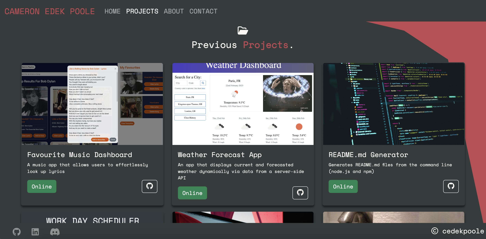
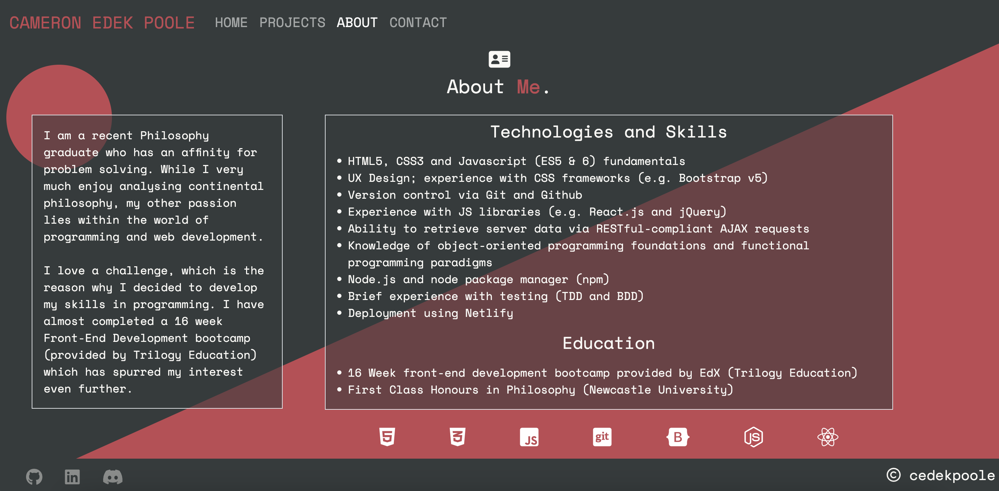
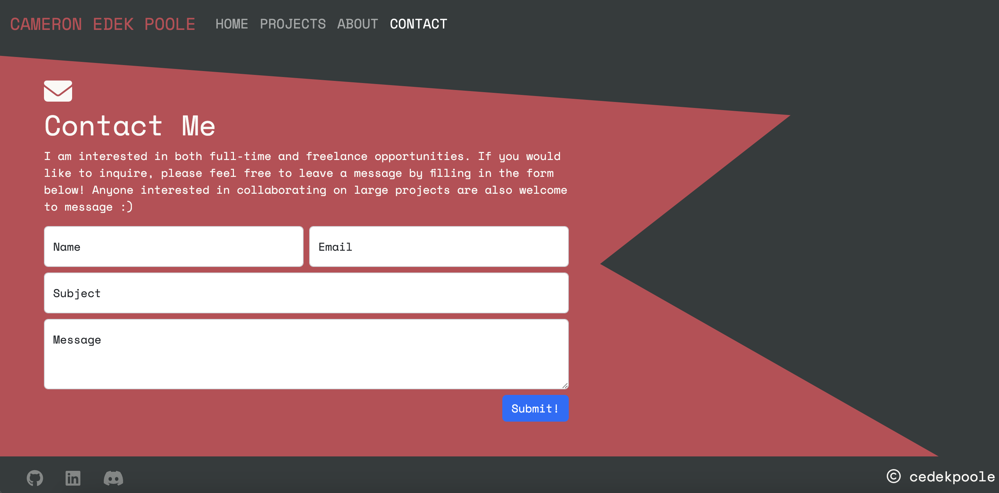

# React.js Portfolio

Link to deployed site: https://cameron-edek-poole.netlify.app 

## Description

This repo displays my most up-to-date portfolio website. Using the very popular JavaScript library [React.js](https://reactjs.org/), in addition to [npm](https://www.npmjs.com/) - a package manager for JS - it was possible to create a sophisticated and modern web application. On top of using these current, industry-standard technologies, it is also important to mention that I undertook the mobile-first approach to responsive design when creating this portfolio. For convenience, the CSS framework 'Bootstrap' (via the npm package '[React-Bootstrap](https://react-bootstrap.github.io/)') was used, aiding in the structure and styling of the site. There is also additional functionality on the Contact page, made possible through the JS package 'emailjs'. '[Emailjs](https://www.emailjs.com/)' allows users to send messages directly to my email address without having to write any server code.

### Technologies and Skills 
- React.js
- Node.js amd npm (emailjs, react-bootstrap and react-router-dom packages)
- JavaScript
- Bootstrap and Vanilla CSS
- Deployment to Netlify
- Mobile-first responsive design

## Installation

N/A 

## Usage

When you first open the [deployed application](https://cameron-edek-poole.netlify.app), the app will automatically direct you to the homepage. From here, there is a small introduction and a clickable button which allows the user to download my CV. Stored within the footer, links to GitHub, LinkedIn and Discord can be found. These links are available to the user on every page. 

Within the navigation bar, users can choose between 4 different pages: Home (the current page), Projects, About and Contact. On the projects page, there are 6 examples of my previous work. On each project card, the user has the option to check out the deployed app (by pressing the 'Online' button) or the project's GitHub repo. 

Information about me lies within the 'About' page. Here, users are welcomed to a brief personal introduction and info pertaining to technologies, skills and education. 

On the 'Contact' page, users are given the ability to send an email directly to me by filling in the form. Once they fill in all the required fields and press submit, the unique message will be sent to my gmail account (via the node package 'emailjs').

To test the responsiveness of the site, open up Device mode on Chrome Dev Tools (Option + Command + J on MacOS, Shift + Control + J on Windows/Linux to open Tools, then Command + Shift + M on MacOS, or Control + Shift + M on Windows/Linux to open Device Mode). From here, you can watch how the page responds when you change the height and width of the screen. Alternatively, you can also check this by opening the portfolio link (found above) on a mobile device. You will notice that after a certain width, the navbar collapses and provides the user with a hamburger menu instead.

## License

Please refer to the LICENSE in the repo.

## Credits

- The icon animation on the project and contact page came from [Animista](https://animista.net/play/basic).
- The technologies animation on the contact page was an idea taken from [Divenector](https://www.youtube.com/watch?v=MYXjjRI7j9c&ab_channel=Divinector) (Youtube channel).
- The document's icon within the tab came from [ICONS8](https://icons8.com/)

## Roadmap

This repo will be added to as my skills progress. The final aim for my portfolio page is to display a number of fully functioning projects and to make it more visually appealing. Any suggestions on how to improve the look and functionality of the page are welcome :).

--- 
## Questions

If you have any questions about the repo, open an issue or contact me directly at cameron-edek-poole@gmail.com. 

You can find more of my work by clicking on my GitHub username: [cedekpoole](https://github.com/cedekpoole/).
Feel free to also add me on [LinkedIn](https://www.linkedin.com/in/cam-edek-poole/)!