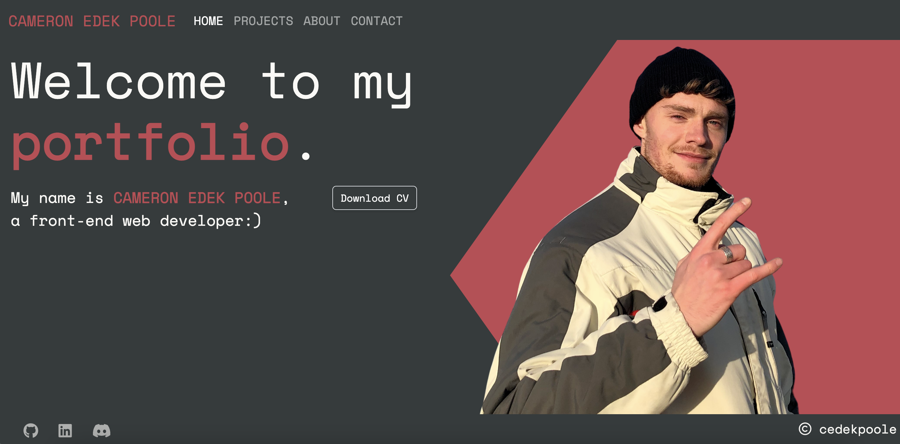

# React.js Portfolio

Linked to depoloyed site: https://cameron-edek-poole.netlify.app 

## Description

### Technologies and Skills 
- React.js
- Node.js amd npm (emailjs, react-bootstrap and react-router-dom packages)
- JavaScript
- Bootstrap and Vanilla CSS
- Deployment to Netlify
- Mobile-first responsive design

## Installation

N/A 

## Usage

When you first open the [deployed application](https://cameron-edek-poole.netlify.app), you are welcomed by the Home page.

To test the responsiveness of the site, open up Device mode on Chrome Dev Tools (Option + Command + J on MacOS, Shift + Control + J on Windows/Linux to open Tools, then Command + Shift + M on MacOS, or Control + Shift + M on Windows/Linux to open Device Mode). From here, you can watch how the page responds when you change the height and width of the screen. Alternatively, you can also check this by opening the portfolio link (found above) on a mobile device. You will notice that after a certain width, the navbar collapses and provides the user with a hamburger menu instead.

## Roadmap

This repo will be added to as my skills progress. The final aim for my portfolio page is to display a number of fully functioning projects and to make it more visually appealing. Any suggestions on how to improve the look and functionality of the page are welcome :).

## Credits

- The icon animation on the project and contact page came from [Animista](https://animista.net/play/basic).
- The technologies animation on the contact page was an idea taken from [Divenector](https://www.youtube.com/watch?v=MYXjjRI7j9c&ab_channel=Divinector) (Youtube channel).
- The document's icon within the tab came from [ICONS8](https://icons8.com/)

## License

Please refer to the LICENSE in the repo.

---

## Questions

If you have any questions about the repo, open an issue or contact me directly at cameron-edek-poole@gmail.com. 

You can find more of my work by clicking on my GitHub username: [cedekpoole](https://github.com/cedekpoole/).
Feel free to also add me on [LinkedIn](https://www.linkedin.com/in/cam-edek-poole/). :)